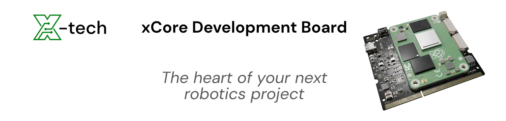

<p align="center">
  <a>
    <h1 align="center">xCore Docs</h1>
    
  </a>
</p>
<br>
<p align="center">
  This is the source code for the <a href="https://core.x-tech.online/">xCore Docs</a>.
</p>

<br>
<hr>
<br>

<p align="center">
  If you find some issues with the documentation or want to add to it, please fork this repo and open a pull request.<br>It's a good idea to tell me that you are working on some part of the website. This maximises the chance, that your changes will be merged to the website.
</p>

<br>
<hr>
<br>

<ul>
<li><a href="#running-local">Running the website locally...</a></li>
<ul>
  <li><a href="#running-local-hugo">on Bare Metal</a></li>
  <li><a href="#running-local-container">on Podman/Docker</a></li>
  <li><a href="#running-local-docker-compose">on Docker Compose</a></li>
</ul>
<br>
<li><!--<a href="#github-pages">-->Running the website on github pages <i>(To be written)</i><!--</a>--></li>
<br>
<li><a href="#troubleshooting">Troubleshooting...</a></li>
</ul>

<br>
<hr>
<br>

<h2 id="running-local">
  Running the website locally...
</h2>

<br>

<h3 id="running-local-hugo">
  Running the website locally on Bare Metal
</h3>

Building and running the site locally requires a recent `extended` version of [Hugo](https://gohugo.io).  
You can find out more about how to install Hugo for your environment in our
[Getting started](https://www.docsy.dev/docs/getting-started/#prerequisites-and-installation) guide.

Once you've made your working copy of the site repo, from the repo root folder, run:
```bash
hugo server
```

<br>

<h3 id="running-local-container">
  Running the website locally on Podman/Docker
</h3>

_to be writen..._


<br>

<h3 id="running-local-docker-compose">
  Running the website locally on Docker Compose
</h3>

You can run this inside a container _([Docker](https://docs.docker.com/) or [Podman](https://podman.io/))_, the container runs with a volume bound to the `docsy-example` folder. This approach doesn't require you to install any dependencies other than [Docker Desktop](https://www.docker.com/products/docker-desktop) on Windows and Mac, and [Docker Compose](https://docs.docker.com/compose/install/) on Linux.

- Build the docker image
   ```bash
   docker compose build
   ```

- Run the built image
   ```bash
   docker compose up
   ```
> [!TIP]
> You can run both commands at once with `docker compose up --build`.

- Verify that the service is working.

   Open your web browser and type `http://localhost:1313` in your navigation bar,
   This opens a local instance of the this homepage. You can now make
   changes to the website and those changes will immediately show up in your
   browser after you save (not on Windows though. Hot reload only works on the non-dockerized hugo!).

### Cleanup

To stop Docker Compose, on your terminal window, press <kbd>Ctrl</kbd>+<kbd>C</kbd>.

To remove the produced images run:
```bash
docker compose rm
```
For more information see the [Docker Compose documentation](https://docs.docker.com/compose/gettingstarted/).

<br>
<hr>
<br>

<h2 id="troubleshooting">
  Troubleshooting
</h2>

As you run the website locally, you may run into the following error:
```
➜ hugo server

INFO 2021/01/21 21:07:55 Using config file: 
Building sites … INFO 2021/01/21 21:07:55 syncing static files to /
Built in 288 ms
Error: Error building site: TOCSS: failed to transform "scss/main.scss" (text/x-scss): resource "scss/scss/main.scss_9fadf33d895a46083cdd64396b57ef68" not found in file cache
```

This error occurs if you have not installed the extended version of Hugo.
See this [section](https://www.docsy.dev/docs/get-started/docsy-as-module/installation-prerequisites/#install-hugo) of the user guide for instructions on how to install Hugo.

Or you may encounter the following error:
```
➜ hugo server

Error: failed to download modules: binary with name "go" not found
```

This error occurs if you have not installed the `go` programming language on your system.
See this [section](https://www.docsy.dev/docs/get-started/docsy-as-module/installation-prerequisites/#install-go-language) of the user guide for instructions on how to install `go`.
