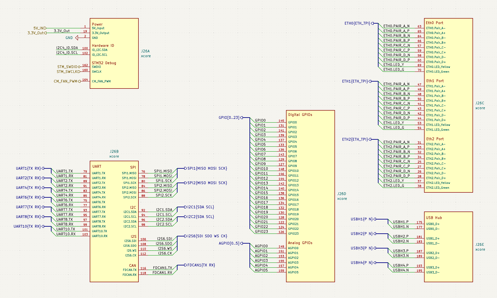
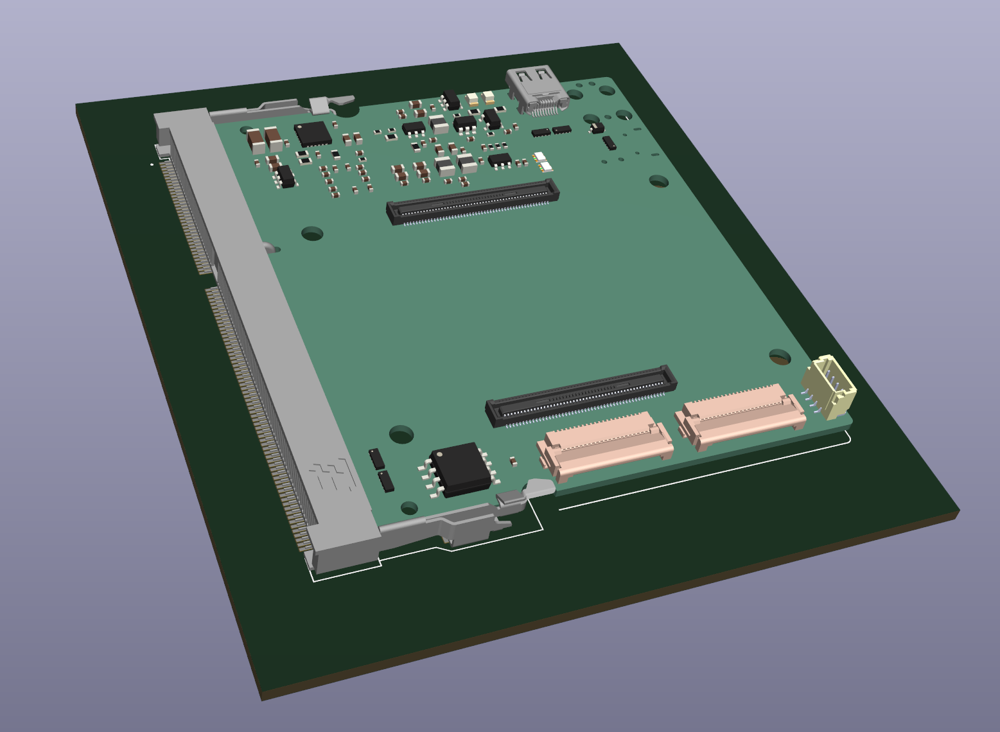

Download the KiCAD Library here: [Download](./xcore-lib.zip)

## KiCAD Symbol

The KiCAD symbol for the xCore development board groups all pins in to an easy-to-use symbol:

## KiCAD Footprint

The library also contains the footprint with mounting hole locations and a 3d model:

