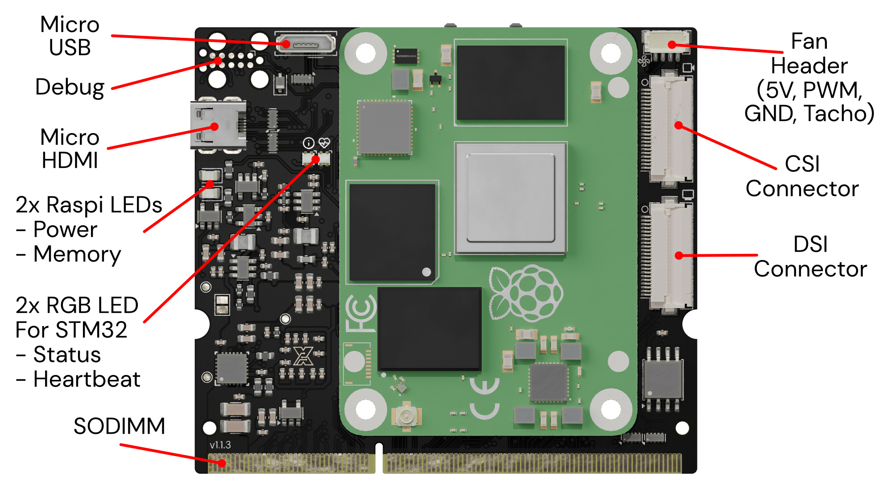

The xCore platform provides a highly flexible and powerful interface to connect various hardware components seamlessly into your projects. This page describes the key connections available through the SODIMM connector, along with an overview of the additional interfaces for the Raspberry Pi CM4, digital interfaces, and power requirements.

# External Interfaces

You can connect external peripheral devices, sensors, and communication modules to your custom robotics systems via the external interfaces on the xCore board. These interfaces are routed primarily through the SODIMM connector, but several additional interfaces provide direct access to Raspberry Pi CM4 peripherals.

The external interfaces include general-purpose communication protocols such as UART, SPI, I²C, and USB, enabling a wide range of connected devices. Ethernet connectivity via twisted-pair interfaces provides fast, reliable networking. The board also includes interfaces for video, camera, and display connections.

## Main Connector (SODIMM)

The SODIMM connector serves as the primary interface for you to connect external peripherals and devices to the xCore board. It groups power, communication, and networking connections into a single, convenient interface, simplifying the integration of xCore into your custom hardware projects.

Through the SODIMM connector, you have access to general-purpose digital interfaces such as UART, SPI, I²C, CAN, and more. Additionally, the connector provides Ethernet and USB interfaces for high-speed data transfer and device communication.

### Power Interface

You need to provide a single **5V power input** through the [SODIMM connector]( "SODIMM connector"). This 5V rail powers the internal components of the xCore platform, including the STM32H723 microcontroller, Ethernet switch, and Raspberry Pi CM4.  
The xCore integrates a power supervisor which monitors the input voltage and shuts down on under- or overvoltage conditions.

Additionally, the xCore board generates a **3.3V rail** internally. This 3.3V supply is also made available to you through the SODIMM connector for external devices that may require it.

### Digital Interfaces

The xCore board provides a variety of general-purpose digital interfaces, allowing you to connect a wide range of peripherals and external devices. These interfaces are routed through the SODIMM connector, and all are designed to be flexible for your custom use cases.

- **7x UART** interfaces for serial communication.
- **2x SPI** interfaces available for high-speed communication with external sensors or devices.
- **3x I²C** interfaces for communication with low-speed devices such as sensors, EEPROMs, etc.
- **1x CAN** interface.
- **1x I2S** interface for communication with audio devices.
- **24x digital GPIO** for custom signaling or control.
- **6x analog / digital GPIO** can be used either as analog inputs or digital GPIOs.
- **3x Gigabit Ethernet** twisted pair interfaces for fast communication. These connect to a five-port stand-alone gigabit Ethernet switch. The other two ports are connected to the STM32H723 and the Raspberry Pi CM4 interface.
- **4x USB 2.0 Host** interfaces connected to the CM4 via USB hub. You can use this to connect devices like gamepads, cameras, or USB storage devices via USB 2.0 ports.
- **SWD Interface** SWDIO/SWCLK interface to program the STM32 through the SODIMM connector.

A detailed description can be found here: [SODIMM connector]( "SODIMM connector").

## Additional Interfaces

In addition to the interfaces available via the SODIMM connector, the xCore board provides direct connections to the Raspberry Pi CM4, making it easier for you to use the full range of CM4 peripherals in your project.

### CM4 Direct Interfaces:

- **Micro HDMI**: Connect a display via the micro HDMI interface for video output.
- **USB Device (for OS Upload)**: Use this USB interface to upload an operating system to the CM4.
- **CSI (Camera Serial Interface)**: Direct connection for a camera module using the CSI interface.
- **DSI (Display Serial Interface)**: Direct connection for a display using the DSI interface.
- **SD Card Interface (for CM4 Lite)**: Provides SD card storage access for Raspberry Pi CM4 Lite models.
- **Fan Connector**: Allows you to connect a cooling fan to manage thermal performance for the CM4.

These additional interfaces enable the xCore platform to fully leverage the capabilities of the Raspberry Pi CM4, offering high-speed data transfer, camera and display connectivity.

### Tag Connect Debug Interface
The xCore board contains a Tag Connect connector for debugging. In addition to SWD, this connector provides a serial connection to both the CM4 and the STM32.

# Internal Interfaces

The internal interfaces of the xCore board are the connections that remain wired directly on the board. These include components and communication lines that facilitate the core functionality of the platform.

- **IMU (Inertial Measurement Unit)**: The xCore integrates an IMU, providing precise motion sensing and orientation data, essential for robotics applications like navigation and stabilization. This IMU is wired directly to the STM32H723.
- **SPI Flash**: The xCore contains onboard SPI flash storage that is wired directly to the STM32H723. This flash memory is available for you to store persistent data.
- **Debug Interfaces**: The STM32 and CM4 are connected with SWD and UART interfaces. This way the CM4 can upload software directly to the STM32.
- **Power Interfaces**: The STM32 can control the CM4's power.
- **2x RGB LEDs**: Two RGB LEDs can be used to show status information. 
