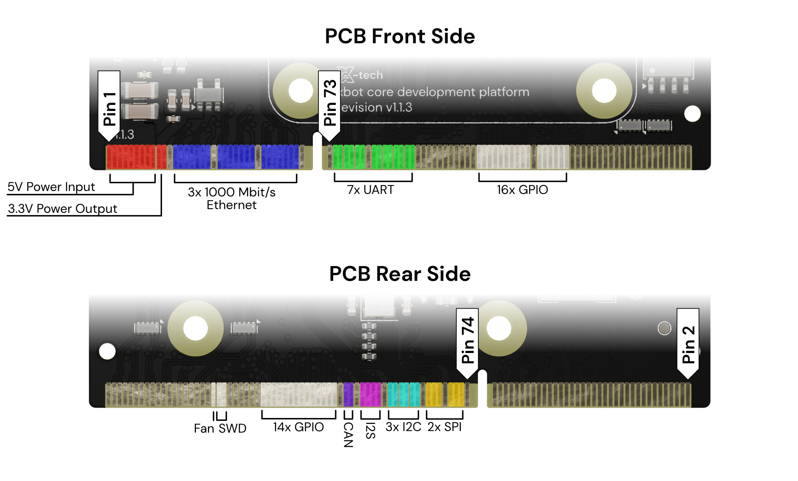
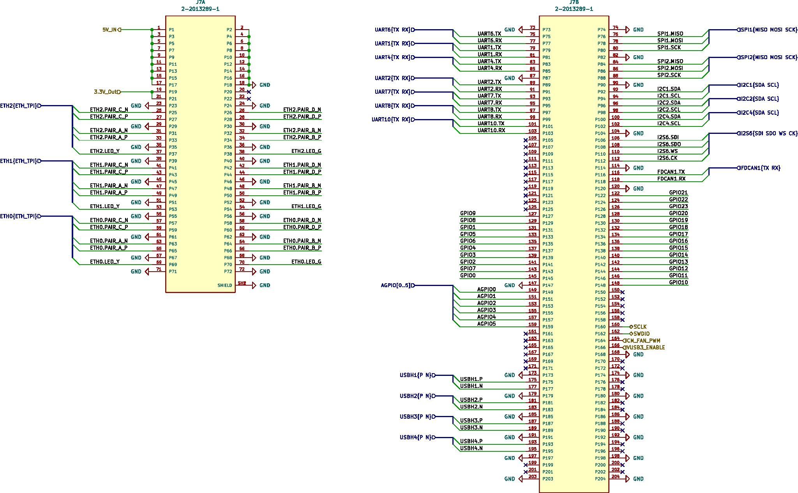
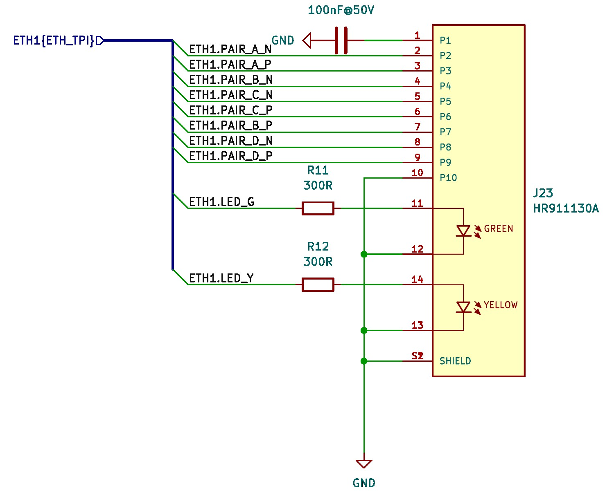

The xCore board uses a **SODIMM connector** to interface with external hardware. SODIMM (Small Outline Dual In-line
Memory Module) connectors are well-suited for high-speed signal transmission and offer a large number of pins in a
compact footprint.

### Why SODIMM?

- **Off-the-shelf availability**: SODIMM connectors and mating parts are widely available and manufactured to high
  standards, making it easy to source reliable parts.
- **Compact footprint**: SODIMM connectors allow for a dense pinout with a small board footprint, making it ideal for
  compact designs.
- **High-speed compatibility**: SODIMM connectors are designed to handle fast signals, such as those used in Ethernet,
  SPI, and other high-speed communication protocols.
- **Many available pins**: With up to 200 pins, SODIMM connectors provide plenty of room for power, data, and control
  signals, giving you flexibility when designing your custom carrier boards.
- **Modular flexibility**: Using a SODIMM connector allows the xCore platform to easily plug into different systems or
  custom carrier boards, simplifying integration and modularity.

## Interface Overview
In this image you can see an overview of the interfaces available on the SODIMM connector:

More detailed information can be found on the schematic or the [pinout table]( "Pinout Table") below.

### Compatible SODIMM Connectors

Any DDR3 SODIMM connector should work as a mating connector for the xCore PCB.

**Tested and confirmed working are these connectors:**
- FOXCONN AS0A621-H2S6-7H
- TE Connectivity 2-2013289-1

### Ethernet Connectors

To connect Ethernet ports to the xCore board via the SODIMM connector, you'll need to provide external **magnetics**.
Magnetics are required to interface between the twisted-pair Ethernet signals and the physical Ethernet ports on your
custom carrier board.

We recommend using **MagJack connectors** that integrate the necessary magnetics, simplifying your design and reducing
component count. MagJacks are RJ45 Ethernet jacks with integrated magnetics, designed specifically for Ethernet
connections. They come in various configurations and are available from many manufacturers like Amphenol, TE
Connectivity, and Molex.

When selecting MagJack connectors, ensure they are compatible with **10/100/1000BASE-T Ethernet** standards.

**Tested and confirmed part:** HANRUN HR911130A

Adding the Ethernet connector to the xCore is simple. When using a connector with integrated connections, you can connect it as shown in this image:

## Pinout Table

This table shows the SDIMM pinout in detail:

| SODIMM Pin | Name              | STM32 Pin | Voltage Level | Note                                                                                          |   |   |
|------------|-------------------|-----------|---------------|-----------------------------------------------------------------------------------------------|---|---|
| 1          | 5V\_IN            |           | 5V            | 5V Power Input (4.75 - 5.25V, 3A).                                                            |   |   |
| 2          | GND               |           |               |                                                                                               |   |   |
| 3          | 5V\_IN            |           | 5V            | 5V Power Input (4.75 - 5.25V, 3A).                                                            |   |   |
| 4          | GND               |           |               |                                                                                               |   |   |
| 5          | 5V\_IN            |           | 5V            | 5V Power Input (4.75 - 5.25V, 3A).                                                            |   |   |
| 6          | GND               |           |               |                                                                                               |   |   |
| 7          | 5V\_IN            |           | 5V            | 5V Power Input (4.75 - 5.25V, 3A).                                                            |   |   |
| 8          | GND               |           |               |                                                                                               |   |   |
| 9          | 5V\_IN            |           | 5V            | 5V Power Input (4.75 - 5.25V, 3A).                                                            |   |   |
| 10         | GND               |           |               |                                                                                               |   |   |
| 11         | 5V\_IN            |           | 5V            | 5V Power Input (4.75 - 5.25V, 3A).                                                            |   |   |
| 12         | GND               |           |               |                                                                                               |   |   |
| 13         | 5V\_IN            |           | 5V            | 5V Power Input (4.75 - 5.25V, 3A).                                                            |   |   |
| 14         | GND               |           |               |                                                                                               |   |   |
| 15         | 5V\_IN            |           | 5V            | 5V Power Input (4.75 - 5.25V, 3A).                                                            |   |   |
| 16         | GND               |           |               |                                                                                               |   |   |
| 17         | 5V\_IN            |           | 5V            | 5V Power Input (4.75 - 5.25V, 3A).                                                            |   |   |
| 18         | GND               |           |               |                                                                                               |   |   |
| 19         | 3\.3V Output      |           | 3\.3V         | 3.3V Power Output, 500mA max (sum on both pins)                                               |   |   |
| 20         | NC                |           |               |                                                                                               |   |   |
| 21         | 3\.3V Output      |           | 3\.3V         | 3.3V Power Output, 500mA max (sum on both pins)                                               |   |   |
| 22         | NC                |           |               |                                                                                               |   |   |
| 23         | GND               |           |               |                                                                                               |   |   |
| 24         | GND               |           |               |                                                                                               |   |   |
| 25         | ETH2 Pair C -     |           | Differential  |                                                                                               |   |   |
| 26         | ETH2 Pair D -     |           | Differential  |                                                                                               |   |   |
| 27         | ETH2 Pair C +     |           | Differential  |                                                                                               |   |   |
| 28         | ETH2 Pair D +     |           | Differential  |                                                                                               |   |   |
| 29         | GND               |           |               |                                                                                               |   |   |
| 30         | GND               |           |               |                                                                                               |   |   |
| 31         | ETH2 Pair A -     |           | Differential  |                                                                                               |   |   |
| 32         | ETH2 Pair B -     |           | Differential  |                                                                                               |   |   |
| 33         | ETH2 Pair A +     |           | Differential  |                                                                                               |   |   |
| 34         | ETH2 Pair B +     |           | Differential  |                                                                                               |   |   |
| 35         | GND               |           |               |                                                                                               |   |   |
| 36         | GND               |           |               |                                                                                               |   |   |
| 37         | ETH2 LED YELLOW   |           |               |                                                                                               |   |   |
| 38         | ETH2 LED GREEN    |           |               |                                                                                               |   |   |
| 39         | GND               |           |               |                                                                                               |   |   |
| 40         | GND               |           |               |                                                                                               |   |   |
| 41         | ETH1 Pair C -     |           | Differential  |                                                                                               |   |   |
| 42         | ETH1 Pair D -     |           | Differential  |                                                                                               |   |   |
| 43         | ETH1 Pair C +     |           | Differential  |                                                                                               |   |   |
| 44         | ETH1 Pair D +     |           | Differential  |                                                                                               |   |   |
| 45         | GND               |           |               |                                                                                               |   |   |
| 46         | GND               |           |               |                                                                                               |   |   |
| 47         | ETH1 Pair A -     |           | Differential  |                                                                                               |   |   |
| 48         | ETH1 Pair B -     |           | Differential  |                                                                                               |   |   |
| 49         | ETH1 Pair A +     |           | Differential  |                                                                                               |   |   |
| 50         | ETH1 Pair B +     |           | Differential  |                                                                                               |   |   |
| 51         | GND               |           |               |                                                                                               |   |   |
| 52         | GND               |           |               |                                                                                               |   |   |
| 53         | ETH1 LED YELLOW   |           |               |                                                                                               |   |   |
| 54         | ETH1 LED GREEN    |           |               |                                                                                               |   |   |
| 55         | GND               |           |               |                                                                                               |   |   |
| 56         | GND               |           |               |                                                                                               |   |   |
| 57         | ETH0 Pair C -     |           | Differential  |                                                                                               |   |   |
| 58         | ETH0 Pair D -     |           | Differential  |                                                                                               |   |   |
| 59         | ETH0 Pair C +     |           | Differential  |                                                                                               |   |   |
| 60         | ETH0 Pair D +     |           | Differential  |                                                                                               |   |   |
| 61         | GND               |           |               |                                                                                               |   |   |
| 62         | GND               |           |               |                                                                                               |   |   |
| 63         | ETH0 Pair A -     |           | Differential  |                                                                                               |   |   |
| 64         | ETH0 Pair B -     |           | Differential  |                                                                                               |   |   |
| 65         | ETH0 Pair A +     |           | Differential  |                                                                                               |   |   |
| 66         | ETH0 Pair B +     |           | Differential  |                                                                                               |   |   |
| 67         | GND               |           |               |                                                                                               |   |   |
| 68         | GND               |           |               |                                                                                               |   |   |
| 69         | ETH0 LED YELLOW   |           |               |                                                                                               |   |   |
| 70         | ETH0 LED GREEN    |           |               |                                                                                               |   |   |
| 71         | GND               |           |               |                                                                                               |   |   |
| 72         | GND               |           |               |                                                                                               |   |   |
| 73         | GND               |           |               |                                                                                               |   |   |
| 74         | GND               |           |               |                                                                                               |   |   |
| 75         | UART6 TX          | PC6       | 3\.3V         |                                                                                               |   |   |
| 76         | SPI1 MISO         | PG9       | 3\.3V         |                                                                                               |   |   |
| 77         | UART6 RX          | PC7       | 3\.3V         |                                                                                               |   |   |
| 78         | SPI1 MOSI         | PD7       | 3\.3V         |                                                                                               |   |   |
| 79         | UART1 TX          | PA9       | 3\.3V         |                                                                                               |   |   |
| 80         | SPI1 SCK          | PA5       | 3\.3V         |                                                                                               |   |   |
| 81         | UART1 RX          | PA10      | 3\.3V         |                                                                                               |   |   |
| 82         | GND               |           |               |                                                                                               |   |   |
| 83         | UART4 TX          | PA12      | 3\.3V         |                                                                                               |   |   |
| 84         | SPI2 MISO         | PB14      | 3\.3V         |                                                                                               |   |   |
| 85         | UART4 RX          | PA11      | 3\.3V         |                                                                                               |   |   |
| 86         | SPI2 MOSI         | PB15      | 3\.3V         |                                                                                               |   |   |
| 87         | GND               |           |               |                                                                                               |   |   |
| 88         | SPI2 SCK          | PD3       | 3\.3V         |                                                                                               |   |   |
| 89         | UART2 TX          | PD5       | 3\.3V         |                                                                                               |   |   |
| 90         | GND               |           |               |                                                                                               |   |   |
| 91         | UART2 RX          | PD6       | 3\.3V         |                                                                                               |   |   |
| 92         | I2C1 SDA          | PB7       | 3\.3V         | Pull-Up to 3.3V included on xCore                                                             |   |   |
| 93         | UART7 TX          | PF7       | 3\.3V         |                                                                                               |   |   |
| 94         | I2C1 SCL          | PB6       | 3\.3V         | Pull-Up to 3.3V included on xCore                                                             |   |   |
| 95         | UART7 RX          | PA8       | 3\.3V         |                                                                                               |   |   |
| 96         | I2C2 SDA          | PB11      | 3\.3V         | Pull-Up to 3.3V included on xCore                                                             |   |   |
| 97         | UART8 TX          | PE1       | 3\.3V         |                                                                                               |   |   |
| 98         | I2C2 SCL          | PB10      | 3\.3V         | Pull-Up to 3.3V included on xCore                                                             |   |   |
| 99         | UART8 RX          | PE0       | 3\.3V         |                                                                                               |   |   |
| 100        | ID I2C SDA (I2C4) | PD13      | 3\.3V         | 100kHz only! Connect to EEPROM for carrier board detection. Pull-Up to 3.3V included on xCore |   |   |
| 101        | UART10 TX         | PE3       | 3\.3V         |                                                                                               |   |   |
| 102        | ID I2C SCL (I2C4) | PD12      | 3\.3V         | 100kHz only! Connect to EEPROM for carrier board detection. Pull-Up to 3.3V included on xCore |   |   |
| 103        | UART10 RX         | PE2       | 3\.3V         |                                                                                               |   |   |
| 104        | GND               |           |               |                                                                                               |   |   |
| 105        | NC                |           |               |                                                                                               |   |   |
| 106        | I2S6 SDI          | PG12      | 3\.3V         |                                                                                               |   |   |
| 107        | NC                |           |               |                                                                                               |   |   |
| 108        | I2S6 SDO          | PB5       | 3\.3V         |                                                                                               |   |   |
| 109        | NC                |           |               |                                                                                               |   |   |
| 110        | I2S6 WS           | PA15      | 3\.3V         |                                                                                               |   |   |
| 111        | NC                |           |               |                                                                                               |   |   |
| 112        | I2S6 CK           | PG13      | 3\.3V         |                                                                                               |   |   |
| 113        | NC                |           |               |                                                                                               |   |   |
| 114        | GND               |           |               |                                                                                               |   |   |
| 115        | NC                |           |               |                                                                                               |   |   |
| 116        | FDCAN TX          | PB9       | 3\.3V         |                                                                                               |   |   |
| 117        | NC                |           |               |                                                                                               |   |   |
| 118        | FDCAN RX          | PB8       | 3\.3V         |                                                                                               |   |   |
| 119        | NC                |           |               |                                                                                               |   |   |
| 120        | GND               |           |               |                                                                                               |   |   |
| 121        | NC                |           |               |                                                                                               |   |   |
| 122        | GPIO 21           | PE7       | 3\.3V         |                                                                                               |   |   |
| 123        | NC                |           |               |                                                                                               |   |   |
| 124        | GPIO 22           | PE8       | 3\.3V         |                                                                                               |   |   |
| 125        | NC                |           |               |                                                                                               |   |   |
| 126        | GPIO 23           | PE9       | 3\.3V         |                                                                                               |   |   |
| 127        | GPIO 9            | PE10      | 3\.3V         |                                                                                               |   |   |
| 128        | GPIO 20           | PE11      | 3\.3V         |                                                                                               |   |   |
| 129        | GPIO 8            | PD8       | 3\.3V         |                                                                                               |   |   |
| 130        | GPIO 19           | PE12      | 3\.3V         |                                                                                               |   |   |
| 131        | GPIO 1            | PD11      | 3\.3V         |                                                                                               |   |   |
| 132        | GPIO 18           | PE13      | 3\.3V         |                                                                                               |   |   |
| 133        | GPIO 5            | PG3       | 3\.3V         |                                                                                               |   |   |
| 134        | GPIO 17           | PE14      | 3\.3V         |                                                                                               |   |   |
| 135        | GPIO 6            | PG7       | 3\.3V         |                                                                                               |   |   |
| 136        | GPIO 16           | PE15      | 3\.3V         |                                                                                               |   |   |
| 137        | GPIO 4            | PE6       | 3\.3V         |                                                                                               |   |   |
| 138        | GPIO 15           | PD9       | 3\.3V         |                                                                                               |   |   |
| 139        | GPIO 3            | PE5       | 3\.3V         |                                                                                               |   |   |
| 140        | GPIO 14           | PG2       | 3\.3V         |                                                                                               |   |   |
| 141        | GPIO 2            | PE4       | 3\.3V         |                                                                                               |   |   |
| 142        | GPIO 13           | PG4       | 3\.3V         |                                                                                               |   |   |
| 143        | GPIO 7            | PG10      | 3\.3V         |                                                                                               |   |   |
| 144        | GPIO 12           | PG5       | 3\.3V         |                                                                                               |   |   |
| 145        | GPIO 0            | PD4       | 3\.3V         |                                                                                               |   |   |
| 146        | GPIO 11           | PG8       | 3\.3V         |                                                                                               |   |   |
| 147        | GND               |           |               |                                                                                               |   |   |
| 148        | GPIO 10           | PD10      | 3\.3V         |                                                                                               |   |   |
| 149        | AGPIO 0           | PA0       | 3\.3V         |                                                                                               |   |   |
| 150        | NC                |           |               |                                                                                               |   |   |
| 151        | AGPIO 1           | PA3       | 3\.3V         |                                                                                               |   |   |
| 152        | NC                |           |               |                                                                                               |   |   |
| 153        | AGPIO 2           | PA4       | 3\.3V         |                                                                                               |   |   |
| 154        | NC                |           |               |                                                                                               |   |   |
| 155        | AGPIO 3           | PA6       | 3\.3V         |                                                                                               |   |   |
| 156        | NC                |           |               |                                                                                               |   |   |
| 157        | AGPIO 4           | PB0       | 3\.3V         |                                                                                               |   |   |
| 158        | NC                |           |               |                                                                                               |   |   |
| 159        | AGPIO 5           | PB1       | 3\.3V         |                                                                                               |   |   |
| 160        | STM32 SWCLK       | PA14      | 3\.3V         |                                                                                               |   |   |
| 161        | NC                |           |               |                                                                                               |   |   |
| 162        | STM32 SWDIO       | PA13      | 3\.3V         |                                                                                               |   |   |
| 163        | NC                |           |               |                                                                                               |   |   |
| 164        | CM4 Fan PWM       |           | 3\.3V         | Don’t pull this pin down!                                                                     |   |   |
| 165        | NC                |           |               |                                                                                               |   |   |
| 166        | RESERVED          |           |               |                                                                                               |   |   |
| 167        | NC                |           |               |                                                                                               |   |   |
| 168        | GND               |           |               |                                                                                               |   |   |
| 169        | NC                |           |               |                                                                                               |   |   |
| 170        | RESERVED          |           |               |                                                                                               |   |   |
| 171        | NC                |           |               |                                                                                               |   |   |
| 172        | RESERVED          |           |               |                                                                                               |   |   |
| 173        | GND               |           |               |                                                                                               |   |   |
| 174        | GND               |           |               |                                                                                               |   |   |
| 175        | RESERVED          |           |               |                                                                                               |   |   |
| 176        | RESERVED          |           |               |                                                                                               |   |   |
| 177        | RESERVED          |           |               |                                                                                               |   |   |
| 178        | RESERVED          |           |               |                                                                                               |   |   |
| 179        | GND               |           |               |                                                                                               |   |   |
| 180        | GND               |           |               |                                                                                               |   |   |
| 181        | RESERVED          |           |               |                                                                                               |   |   |
| 182        | RESERVED          |           |               |                                                                                               |   |   |
| 183        | RESERVED          |           |               |                                                                                               |   |   |
| 184        | RESERVED          |           |               |                                                                                               |   |   |
| 185        | GND               |           |               |                                                                                               |   |   |
| 186        | GND               |           |               |                                                                                               |   |   |
| 187        | RESERVED          |           |               |                                                                                               |   |   |
| 188        | RESERVED          |           |               |                                                                                               |   |   |
| 189        | RESERVED          |           |               |                                                                                               |   |   |
| 190        | RESERVED          |           |               |                                                                                               |   |   |
| 191        | GND               |           |               |                                                                                               |   |   |
| 192        | GND               |           |               |                                                                                               |   |   |
| 193        | RESERVED          |           |               |                                                                                               |   |   |
| 194        | RESERVED          |           |               |                                                                                               |   |   |
| 195        | RESERVED          |           |               |                                                                                               |   |   |
| 196        | RESERVED          |           |               |                                                                                               |   |   |
| 197        | GND               |           |               |                                                                                               |   |   |
| 198        | GND               |           |               |                                                                                               |   |   |
| 199        | RESERVED          |           |               |                                                                                               |   |   |
| 200        | RESERVED          |           |               |                                                                                               |   |   |
| 201        | RESERVED          |           |               |                                                                                               |   |   |
| 202        | RESERVED          |           |               |                                                                                               |   |   |
| 203        | GND               |           |               |                                                                                               |   |   |
| 204        | GND               |           |               |                                                                                               |   |   |

