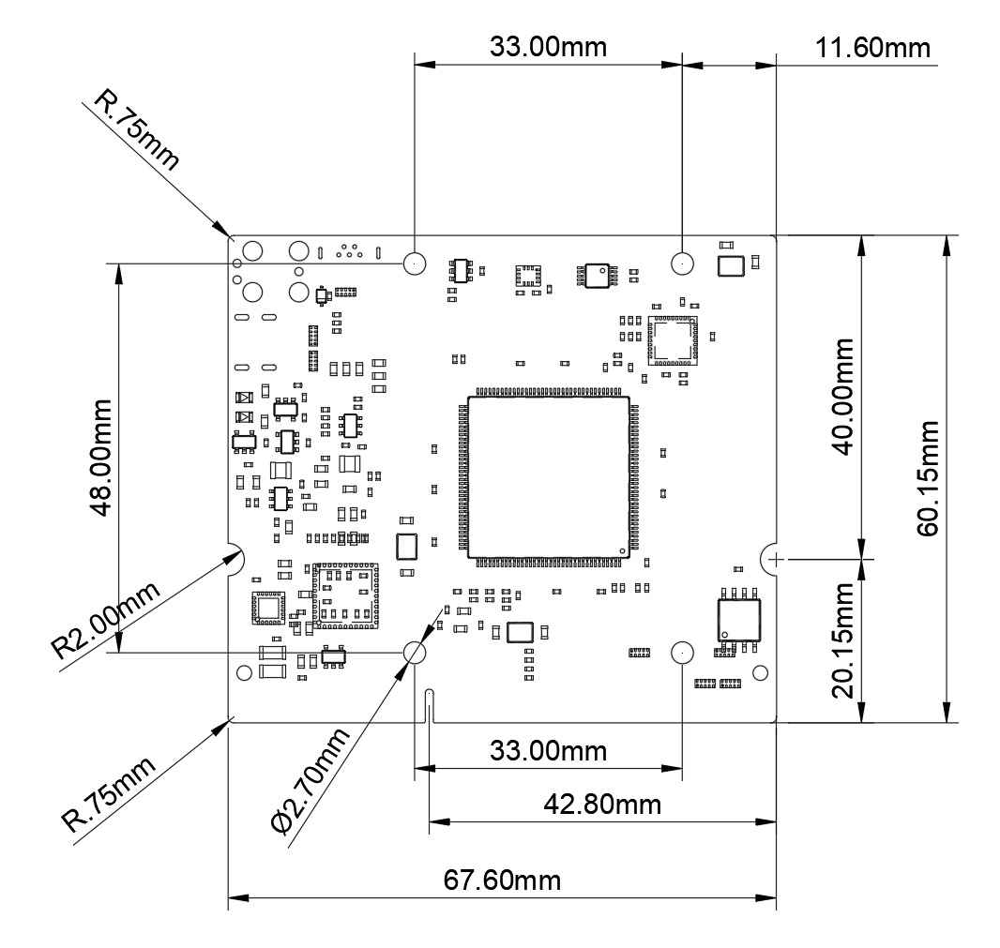

The xCore development board is designed to be compact and easy to integrate into your custom projects. 
This page provides an overview of the physical dimensions, mounting holes, and clearances needed to include xCore in your hardware designs.

## Board Dimensions

- **Overall Dimensions**: The xCore board has a rectangular footprint, measuring **67.60 mm x 60.15 mm**.
- **Width**: 67.60 mm
- **Height**: 60.15 mm
- **PCB Thickness (without components)**: 1.0 mm
- **Module Thickness (including components, without CM4)**: ~5.0 mm

## Mounting Holes

To ensure secure mounting in moving environments, it is recommended to mount the xCore PCB to the carrier PCB.

The mounting holes are matching the holes of the CM4. Use spacers between the CM4 and the carrier board to fasten the board to the carrier.

